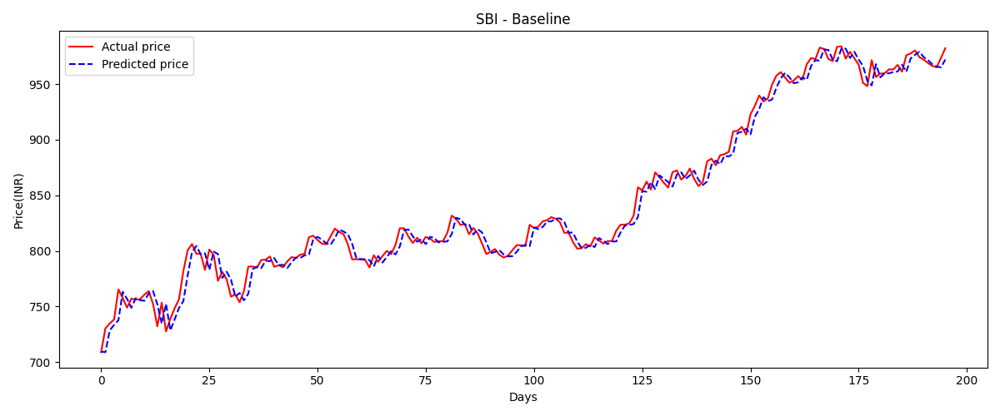
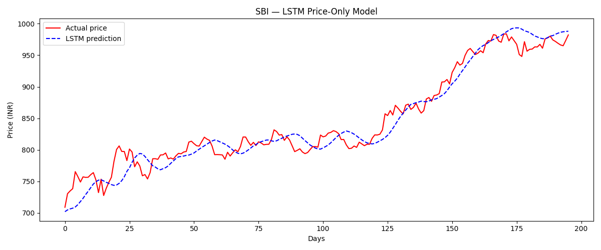

# Wealth Management System rahhh

An institutional-grade private wealth and market intelligence platform for high-net-worth individuals and family offices. Built with React 19, TypeScript, and powered by LSTM-based quantitative prediction engines.




## Features

### Core Modules

- **Dashboard** - Real-time portfolio overview with market indices (Nifty 50, BSE Sensex, Nifty Bank), performance charts, and alpha signals
- **Market Insights** - AI-curated news feed with sentiment analysis (bullish/bearish/neutral/high-alpha) across macro, energy, and policy sectors
- **Portfolio Details** - Holdings management with P&L tracking, sector allocation, and cost basis analysis
- **Prediction Engine** - LSTM-based price forecasting for equities with model confidence scoring and scenario analysis (bull/base/bear cases)
- **Access Recovery** - Multi-tier account recovery including security key restoration for institutional accounts

### Prediction Models

The platform includes two ML models for price prediction:

| Model | Architecture | MAPE | Description |
|-------|-------------|------|-------------|
| Baseline | Linear Regression | ~2-3% | 10-day sliding window with MinMax scaling |
| LSTM | PyTorch LSTM (64 hidden, 2 layers) | ~1-2% | Sequence-to-sequence price-only forecasting |

Models are trained on historical data from Yahoo Finance (e.g., SBIN.NS 2022-2026) and output visualizations with actual vs. predicted price comparisons.

## Tech Stack

### Frontend
- **React 19** with TypeScript
- **Vite 6** - Build tool and dev server
- **Motion** - Animation library (framer-motion successor)
- **Lucide React** - Icon system
- **Tailwind CSS 4** - Utility-first styling

### Backend (Planned)
- **Express.js** - REST API server
- **MongoDB/Mongoose** - Database layer
- **JWT** - Authentication
- **bcrypt** - Password hashing
- **Google Gemini AI** - Market sentiment analysis

### ML/AI
- **PyTorch** - Deep learning framework
- **scikit-learn** - Preprocessing and metrics
- **yfinance** - Market data ingestion
- **matplotlib** - Visualization

## Project Structure

```
RTP-1/
├── src/
│   ├── components/
│   │   ├── AccessRecovery.tsx      # Account recovery flow
│   │   ├── AccessRequest.tsx       # New institution access requests
│   │   ├── Dashboard.tsx           # Main portfolio dashboard
│   │   ├── Layout.tsx              # Sidebar and top navigation
│   │   ├── Login.tsx               # Authentication screen
│   │   ├── MarketInsights.tsx      # News feed with sentiment
│   │   ├── PortfolioDetails.tsx    # Holdings table and actions
│   │   ├── PredictionEngine.tsx    # LSTM forecast visualization
│   │   ├── SecurityKeyRecovery.tsx # Security key restoration
│   │   └── SettingsModal.tsx       # User preferences
│   ├── context/
│   │   └── AuthContext.tsx         # Authentication state management
│   ├── types.ts                    # TypeScript interfaces
│   ├── constants.ts                # Sample holdings and articles
│   ├── App.tsx                     # Main application component
│   ├── main.tsx                    # Entry point
│   └── index.css                   # Tailwind styles
├── model/
│   ├── BL.PY                       # Baseline linear regression model
│   ├── lstm_price.py               # LSTM price prediction model
│   └── lstm_sentiment.py           # Sentiment analysis model (WIP)
├── server/
│   └── index.ts                    # Express API server (WIP)
├── .env                            # Environment variables
├── .env.example                    # Environment template
├── package.json                    # Dependencies
├── tsconfig.json                   # TypeScript config
├── vite.config.ts                  # Vite configuration
└── metadata.json                   # Project metadata
```

## Getting Started

### Prerequisites

- Node.js 18+ and npm
- Python 3.9+ (for ML models)
- Git

### Installation

1. **Clone the repository**
   ```bash
   git clone <repository-url>
   cd RTP-1
   ```

2. **Install frontend dependencies**
   ```bash
   npm install
   ```

3. **Start the development server**
   ```bash
   npm run dev
   ```

### Running ML Models

```bash
# Install Python dependencies
pip install yfinance pandas numpy scikit-learn matplotlib torch

# Run baseline model
python model/BL.PY

# Run LSTM model
python model/lstm_price.py
```

## Scripts

| Command | Description |
|---------|-------------|
| `npm run dev` | Start Vite dev server (port 3000) |
| `npm run build` | Build production bundle |
| `npm run preview` | Preview production build |
| `npm run lint` | TypeScript type checking |
| `npm run server` | Start Express backend |
| `npm run clean` | Remove dist directory |

## License

Apache 2.0

---

**Wealth Management System** - Private Wealth & Intelligence Gateway
